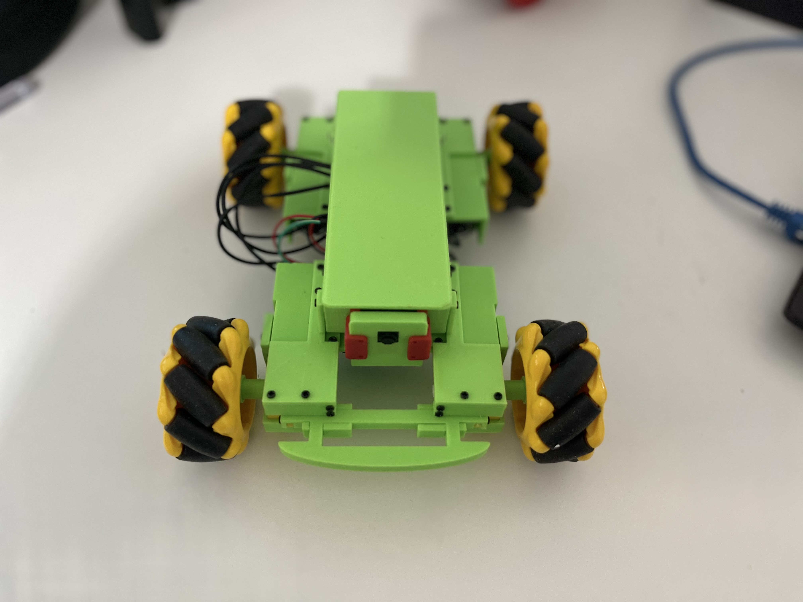

## Welcome to the DC-Rover Project Page!

### About DC-Rover 
It's our take to the classic Robotic Rover that integrates a Raspberry Pi Zero W, an Adafruit Motor Bonnet, a Pi Camera, Tom Oinn's Approx. Engineering Input Library, 2 x 18650 batteries, 4WD TT DC-Motors, Omni-directional Mechanum wheels and Our Own Design Rover Chassis.

### Complete Required Parts List:
* Raspberry Pi W without headers
* Adafruit Motor Bonnet for Raspberry Pi
* Pi Camera
* 2 x 18650 3.7v batteries
* 18650 battery holder with On/Off switch
* 4 x TT DC-Motors
* 4 x Omni-directional Mechanum wheels
* Tytre3d's DC-Rover 3D Printed parts

You can use the [editor on GitHub](https://github.com/tytre3d/DC-Rover/edit/main/README.md) to maintain and preview the content for your website in Markdown files.

Whenever you commit to this repository, GitHub Pages will run [Jekyll](https://jekyllrb.com/) to rebuild the pages in your site, from the content in your Markdown files.

### DC-Rover

Markdown is a lightweight and easy-to-use syntax for styling your writing. It includes conventions for

```Python
from approxeng.input.selectbinder import ControllerResource
from adafruit_motorkit import MotorKit
dc = MotorKit()
import time
 
# Main Loop
while True:
 try:
  with ControllerResource() as joystick:
   while joystick.connected:
    # get x-axis value of the left analog stick
    left_x = joystick.lx
    # get y-axis value of the left analog stick
    left_y = joystick.ly
    m1m4 = left_y + left_x
    m2m3 = left_y - left_x
    lstrafe = joystick['dleft']
    rstrafe = joystick['dright']
    if m1m4 > 1:
      m1m4 = 0.75
    if m1m4 < -1:
      m1m4 = -0.75
    if m2m3 > 1:
      m2m3 = 0.75
    if m2m3 < -1:
      m2m3 = -0.75
    if lstrafe:
      dc.motor1.throttle = 0.75
      dc.motor2.throttle = -0.75
      dc.motor3.throttle = -0.75
      dc.motor4.throttle = 0.75
    elif rstrafe:
      dc.motor1.throttle = -0.75
      dc.motor2.throttle = 0.75
      dc.motor3.throttle = 0.75
      dc.motor4.throttle = -0.75
    else:
      dc.motor1.throttle = m2m3*(-1)
      dc.motor2.throttle = m2m3*(-1)
      dc.motor3.throttle = m1m4*(-1)
      dc.motor4.throttle = m1m4*(-1)
    time.sleep(0.1)
 except IOError:
  # Will raise an exception if no controller/joystick is connected
  print("No Joystick Found!")
  time.sleep(1)
   
```

- Bulleted
- List

1. Numbered
2. List

**Bold** and _Italic_ and `Code` text

[Link](url) and 

For more details see [GitHub Flavored Markdown](https://guides.github.com/features/mastering-markdown/).

### Jekyll Themes

Your Pages site will use the layout and styles from the Jekyll theme you have selected in your [repository settings](https://github.com/tytre3d/DC-Rover/settings/pages). The name of this theme is saved in the Jekyll `_config.yml` configuration file.

### Support or Contact

Having trouble with Pages? Check out our [documentation](https://docs.github.com/categories/github-pages-basics/) or [contact support](https://support.github.com/contact) and we’ll help you sort it out.
